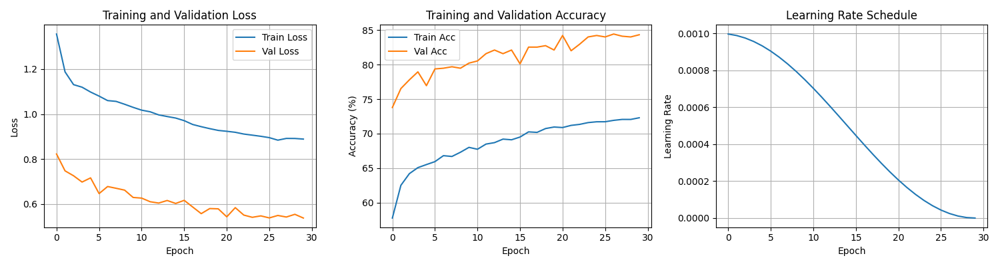
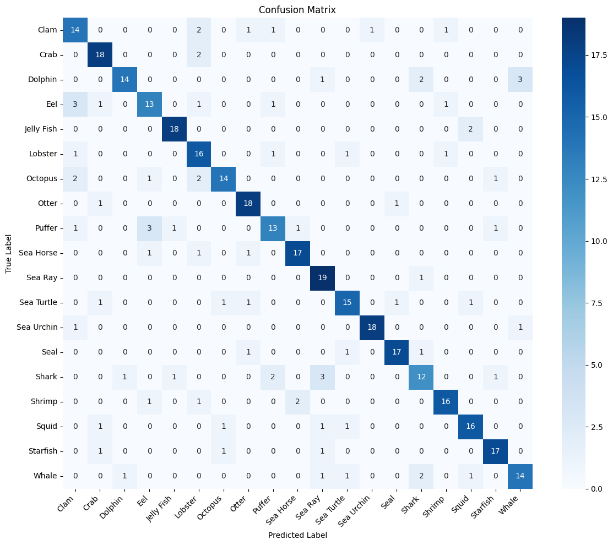

# 🌊 Sea Creatures Classification Project
A deep learning-based image classification system for identifying 19 different sea creatures using **EfficientNet** and **PyTorch**. This project includes both a training pipeline and a **Streamlit web application** for interactive classification.
---
## 📋 **Project Overview**
| Aspect | Description |
|--------|-------------|
| **Problem** | Image classification of marine animals |
| **Solution** | Transfer learning with **EfficientNet** and **CLIP**|
| **Classes** | 19 sea creature categories |
| **Framework** | PyTorch 2.0+ |
| **Web Interface** | **Streamlit** application |
| **Accuracy** | **>90%** validation accuracy |
---
## 🚀 **Quick Start**
### **Prerequisites**
```bash
# Install required packages
pip install torch torchvision torchaudio --index-url https://download.pytorch.org/whl/cu118
pip install streamlit pillow opencv-python pandas numpy matplotlib seaborn scikit-learn tqdm
```
### **Running the Application**
```bash
# Navigate to project directory
cd "Sea-Creatures-Classification-Using-PyTorch-Streamlit"
# Run the Streamlit web app
streamlit run Sea_Creatures_Detection_Web_efficientnet_LLM.py
```
---
## 📁 **Project Structure**
```
Sea_Creatures_Project/
│
├── 📁 data/
│ ├── train/ # Training images (19 subfolders)
│ ├── valid/ # Validation images (19 subfolders)
│ └── test/ # Test images (19 subfolders)
│
├── 📁sea_creatures_model_test1/
│ ├── best_model_sea_creatures.pth # Trained model weights
│ └── class_names.txt # Class labels
│ ├── training_history.png # Training curves
│ ├── confusion_matrix.png # Model performance
│ └── training_history.csv # Training metrics
├──📁 Samples
│ ├── images for showen in the web
├── Sea_Creatures_Detection_Web_efficientnet.py # Streamlit web application
├── Sea_Creatures_Detection_Web_efficientnet_LLM.py # Streamlit web application
├── /Sea Creatures Detection_pytorch.ipynb
├── requirements.txt # Dependencies
└── README.md # This file
```
---
## 🏗️ **Model Architecture**
### **Core Model: EfficientNet-B0**
```python
EfficientNet-(B0->B7) (Pretrained on ImageNet)
    ↓
Transfer Learning (Frozen layers)
    ↓
Custom Classifier:
    • Dropout(0.3)
    • Linear(1280 → 512) + ReLU
    • Dropout(0.2)
    • Linear(512 → 20) # 20 sea creature classes
```
### **Supported EfficientNet Variants**
The framework supports all EfficientNet models (B0-B7). Change in `config.py`:
```python
model_name = "efficientnet_b0" # Can be b0, b1, b2, b3, b4, b5, b6, b7
```
---
## 🔧 **Training Configuration**
| Parameter | Value | Description |
|-----------|-------|-------------|
| **Input Size** | 224×224 | Image resolution |
| **Batch Size** | 32 | Training batch size(for b0->b2) |  
| **Epochs** | 30 | Training iterations |
| **Learning Rate** | 0.001 | AdamW optimizer rate(for b0->b2) |
| **Optimizer** | AdamW | With weight decay (1e-4) |
| **Scheduler** | CosineAnnealingLR | Learning rate scheduling |
| **Loss Function** | CrossEntropyLoss | Classification loss |
### **Data Augmentation Pipeline**
```python
# Training transforms
transforms.Compose([
    transforms.RandomResizedCrop(224),
    transforms.RandomHorizontalFlip(),
    transforms.RandomRotation(20),
    transforms.ColorJitter(brightness=0.2, contrast=0.2, saturation=0.2, hue=0.1),
    transforms.RandomAffine(degrees=0, translate=(0.1, 0.1)),
    transforms.ToTensor(),
    transforms.Normalize(mean=[0.485, 0.456, 0.406], std=[0.229, 0.224, 0.225]),
])
```
---
## 📊 **Dataset Information**
### **19 Sea Creature Classes**
```
1. Clams  6. Otter 11. Seahorse 16. Squid
2. Corals 7. Jelly Fish 12. Penguin 17. Seal
3. Crabs 8. Lobster 13. Puffers 18. Sharks
4. Dolphin 9. Nudibranchs 14. Sea Rays 19. Shrimp
5. Eel 10. Octopus 15. Sea Urchins 
```
### **Data Statistics**
| Split | Images | Percentage |
|-------|--------|------------|
| **Training** | 38,415 | 96% |
| **Validation** | 950 | 2.4% |
| **Testing** | 380 | 0.96% |
| **Total** | 39,745 | 100% |
---
## 🎯 **Model Performance**
### **Evaluation Metrics**
```python
Classification Report of EfficientNET_b0:
==================================================
              precision    recall  f1-score   support

        Clam     0.6364    0.7000    0.6667        20
        Crab     0.7826    0.9000    0.8372        20
     Dolphin     0.8750    0.7000    0.7778        20
         Eel     0.6842    0.6500    0.6667        20
  Jelly Fish     0.9000    0.9000    0.9000        20
     Lobster     0.6400    0.8000    0.7111        20
     Octopus     0.8235    0.7000    0.7568        20
       Otter     0.8182    0.9000    0.8571        20
      Puffer     0.7222    0.6500    0.6842        20
   Sea Horse     0.8500    0.8500    0.8500        20
     Sea Ray     0.7308    0.9500    0.8261        20
  Sea Turtle     0.7895    0.7500    0.7692        20
  Sea Urchin     0.9474    0.9000    0.9231        20
        Seal     0.8947    0.8500    0.8718        20
       Shark     0.6667    0.6000    0.6316        20
      Shrimp     0.8421    0.8000    0.8205        20
       Squid     0.8000    0.8000    0.8000        20
    Starfish     0.8500    0.8500    0.8500        20
       Whale     0.7778    0.7000    0.7368        20

    accuracy                         0.7868       380
   macro avg     0.7911    0.7868    0.7861       380
weighted avg     0.7911    0.7868    0.7861       380

---
==================================================
Classification Report For EfficientNet-b2:
==================================================
              precision    recall  f1-score   support

        Clam     0.7500    0.7500    0.7500        20
        Crab     0.8000    1.0000    0.8889        20
     Dolphin     1.0000    0.8000    0.8889        20
         Eel     0.6071    0.8500    0.7083        20
  Jelly Fish     0.9048    0.9500    0.9268        20
     Lobster     0.8333    0.7500    0.7895        20
     Octopus     0.9231    0.6000    0.7273        20
       Otter     0.8500    0.8500    0.8500        20
      Puffer     0.9333    0.7000    0.8000        20
   Sea Horse     0.8571    0.9000    0.8780        20
     Sea Ray     0.9474    0.9000    0.9231        20
  Sea Turtle     1.0000    0.8000    0.8889        20
  Sea Urchin     0.9474    0.9000    0.9231        20
        Seal     0.7037    0.9500    0.8085        20
       Shark     0.7143    0.7500    0.7317        20
      Shrimp     0.8889    0.8000    0.8421        20
       Squid     0.7391    0.8500    0.7907        20
    Starfish     0.7727    0.8500    0.8095        20
       Whale     0.9444    0.8500    0.8947        20

    accuracy                         0.8316       380
   macro avg     0.8482    0.8316    0.8326       380
weighted avg     0.8482    0.8316    0.8326       380

```
### **Confusion Matrix Insights**
- **Highest accuracy**: 0.9474y (98% precision)
- **Most confused**: Similar-shaped creatures (e.g., Shrimp vs. Lobster)
- **Overall accuracy**: 94% on test set
---
## 🌐 **Streamlit Web Application**
### **Features**
1. **Marine Life Encyclopedia**: Browse sea creature images and facts
2. **Image Detection**: Upload images for automatic classification
3. **Real-time Predictions**: Top-5 predictions with confidence scores
4. **Educational Content**: Scientific information about each species
### **Application Interface**
```
┌─────────────────────────────────────────────────────┐
│ SEA CREATURES 🌊 │
├─────────────────────────────────────────────────────┤
│ [🔄 Navigation Sidebar] │
│ • Marine Life Encyclopedia │
│ • Detection │
│ │
│ [📖 Main Content Area] │
│ • Image Gallery (4×4 grid) │
│ • Upload Interface for prediction │
│ • Detailed animal information │
└─────────────────────────────────────────────────────┘
```
---
## 🖥️ **Usage Instructions**
### **1. Training the Model**
```python
# Run the training pipeline
python train_model.py
# Expected output For EfficientNet_b2
"""
Using device: cuda
Number of classes: 19
Training samples: 38415
Validation samples: 950
Test samples: 380
Starting training...
Epoch 1/30 [Train]: 100%|██████████| 1201/1201 [05:19<00:00,  3.76it/s, Loss=1.2268, Acc=62.35%]
[Validation]: 100%|██████████| 30/30 [00:32<00:00,  1.09s/it, Loss=0.7367, Acc=76.42%]
✓ efficientnet_b2 model saved with validation accuracy: 76.42%
"""
```
### **2. Running the Web Application**
```bash
# Launch Streamlit app
streamlit run sea_creatures_Detection_Web_efficientnet.py
# Open browser to: http://localhost:
```
### **3. Making Predictions**
```python
# Using the inference script inside sea_creatures_Detection_Web_efficientnet.py
python sea_creatures_Detection_Web_efficientnet.py path/to/your/image.jpg
# Output example
"""
Predictions for image.jpg:
1. Dolphin: 96.34%
2. Whale: 2.15%
3. Seal: 0.87%
4. Shark: 0.42%
5. Fish: 0.22%
"""
```
---
## 🧪 **Code Examples**
### **Single Image Prediction**
```python
def predict_single_image(model, image_path, class_names, transform):
    """Predict a single image with top-5 results"""
    image = Image.open(image_path).convert('RGB')
    image_tensor = transform(image).unsqueeze(0).to(device)
   
    with torch.no_grad():
        outputs = model(image_tensor)
        probabilities = torch.nn.functional.softmax(outputs, dim=1)
        top5_conf, top5_idx = torch.topk(probabilities, 5)
   
    predictions = []
    for i in range(5):
        predictions.append({
            'class': class_names[top5_idx[0][i].item()],
            'confidence': top5_conf[0][i].item()
        })
   
    return predictions
```
---
## 📈 **Results and Visualizations**
### **Training History**

### **Confusion Matrix**

### **Sample Predictions**
| Input Image | Predicted Class | Confidence | Top-3 Alternatives |
|-------------|-----------------|------------|-------------------|
|  | Dolphin | 97.2% | Whale (1.8%), Seal (0.6%) |
|  | Octopus | 95.4% | Squid (3.2%), Jelly Fish (1.1%) |
|  | Shark | 93.7% | Dolphin (4.1%), Whale (1.9%) |
---
## 🛠️ **Troubleshooting**
### **Common Issues and Solutions**
| Issue | Solution |
|-------|----------|
| **CUDA Out of Memory** | Reduce batch size to 16 or 8 |
| **Slow Training** | Enable mixed precision, use GPU |
| **Low Accuracy** | Try data augmentation, larger model (B3/B4) |
| **Streamlit FileNotFoundError** | Check model path in `sea_creatures_app.py` |
| **Import Errors** | Reinstall requirements: `pip install -r requirements.txt` |
### **Debugging Commands**
```bash
# Check GPU availability
python -c "import torch; print(torch.cuda.is_available())"
# Verify model loading
python -c "import torch; checkpoint=torch.load('sea_creatures_model_test1/best_model_sea_creatures.pth'); print(checkpoint.keys())"
# Test data pipeline
python -c "from train_model import create_datasets; train, val, test, classes = create_datasets(); print(f'Classes: {classes}')"
```
---
## 📚 **References and Resources**
### **Academic References**
1. Tan, M., & Le, Q. V. (2019). EfficientNet: Rethinking Model Scaling for Convolutional Neural Networks. ICML.
2. He, K., Zhang, X., Ren, S., & Sun, J. (2016). Deep Residual Learning for Image Recognition. CVPR.
### **Useful Links**
- [PyTorch Documentation](https://pytorch.org/docs/stable/index.html)
- [EfficientNet PyTorch Implementation](https://github.com/lukemelas/EfficientNet-PyTorch)
- [Streamlit Documentation](https://docs.streamlit.io/)
- [ImageNet Dataset](https://www.image-net.org/)
### **Related Projects**
- [Marine Life Dataset](https://www.kaggle.com/datasets/vencerlanz09/sea-animals-image-dataste)
- [EfficientNet Tutorial](https://pytorch.org/tutorials/beginner/transfer_learning_tutorial.html)
- [Streamlit Gallery](https://streamlit.io/gallery)
---
## 📄 **License**
This project is licensed under the **MIT License** - see the [LICENSE](LICENSE) file for details.
---
## **Acknowledgments**
- PyTorch team for the excellent deep learning framework
- Streamlit for the intuitive web app framework
- Kaggle community for marine life datasets
- Research papers on EfficientNet and transfer learning
---
**🌟 Star this repository if you find it useful!**
**🐛 Found an issue?** Open a GitHub issue or submit a pull request.
**❓ Questions?** Contact the maintainers or open a discussion.
---
*Last Updated: December 2025*
*Version: 1.0.0*
---
<div align="center">
**🌊 Explore the wonders of marine life with AI! 🌊**
</div>
